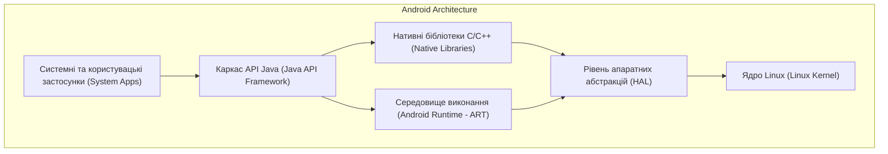
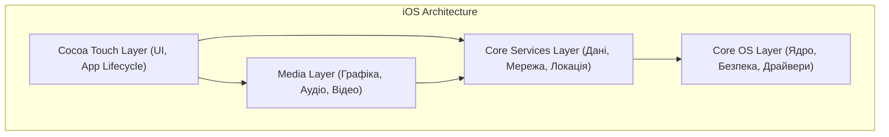

# Практична робота 1: Загальний огляд мобільних платформ

## Варіант 2: Архітектурне порівняння Android та iOS

---

## 1. Рівні архітектури Android та iOS (Зіставлення)

Android та iOS мають різну історію розвитку (Linux-базована відкрита система проти UNIX-базованої закритої екосистеми), проте їхні архітектурні шари концептуально виконують схожі завдання. Нижче наведено таблицю зіставлення рівнів обох операційних систем.

| Рівень абстракції | Android (рівень) | iOS (рівень) | Що містить / За що відповідає |
| :--- | :--- | :--- | :--- |
| **Рівень застосунків та UI** | System Apps & Java API Framework | Cocoa Touch | Компоненти інтерфейсу користувача, управління подіями екрана, доступ до системних додатків (камера, контакти), життєвий цикл застосунку. |
| **Медіа та графіка** | Native C/C++ Libraries & Android Runtime (ART) | Media Layer | Обробка аудіо, відео, 2D/3D графіки (OpenGL, Vulkan для Android / Metal, Core Audio для iOS), анімації. |
| **Системні сервіси та дані** | Java API Framework (Services) | Core Services | Робота з мережею, базами даних (SQLite / Core Data), геолокацією, файловою системою, фоновими процесами. |
| **Низькорівневе ядро** | HAL (Hardware Abstraction Layer) & Linux Kernel | Core OS | Взаємодія з апаратним забезпеченням (Bluetooth, Wi-Fi, сенсори), управління пам'яттю, безпека, драйвери, управління потоками. |

---

## 2. Архітектурні діаграми платформ

Нижче наведено дві діаграми, які ілюструють ієрархію рівнів обох мобільних операційних систем.

### 2.1 Архітектура Android

### 2.2 Архітектура iOS

---

## 3. Моделі життєвого циклу екрана (Activity vs UIViewController)

У моніторингу та управлінні екранами платформи використовують різні класи (`Activity` в Android та `UIViewController` в iOS), але концептуально їхні стани збігаються.

| Стан / Подія | Android (Activity Lifecycle) | iOS (UIViewController Lifecycle) |
| :--- | :--- | :--- |
| **Створення** | `onCreate()` | `viewDidLoad()` |
| **Підготовка до показу** | `onStart()` | `viewWillAppear()` |
| **Екран видимий (взаємодія)** | `onResume()` | `viewDidAppear()` |
| **Втрата фокусу (часткове перекриття)** | `onPause()` | `viewWillDisappear()` |
| **Екран приховано (взаємодія неможлива)**| `onStop()` | `viewDidDisappear()` |
| **Знищення екрана / Звільнення пам'яті**| `onDestroy()` | `deinit` |

### Типові помилки розробників при ігноруванні життєвого циклу:
1. **Витоки пам'яті (Memory Leaks):** Якщо розробник підписується на оновлення геолокації або датчиків у `onResume()` / `viewDidAppear()`, але забуває відписатися в `onPause()` / `viewWillDisappear()`, система продовжує витрачати ресурси, що призводить до швидкого розряджання батареї та крашу (OOM).
2. **Креші при оновленні UI:** Спроба оновити елементи інтерфейсу після асинхронного мережевого запиту, коли користувач вже закрив екран (виклик UI-потоку після `onDestroy` або `viewDidDisappear`).
3. **Втрата стану (Android-специфіка):** При повороті екрана Android знищує і перестворює Activity. Якщо не зберегти дані у `onSaveInstanceState` (або не використати `ViewModel`), усі введені користувачем дані в полях зникнуть.

---

## 4. Практичні наслідки відмінностей для щоденної роботи розробника

1. **Обробка фонових завдань:** В iOS робота у фоні жорстко обмежена системою (Background Tasks) для економії заряду. Процес може бути "вбитий" у будь-який момент. В Android (особливо на версіях до API 26) система давала більше свободи, але зараз вимагає використання специфічних інструментів (`WorkManager`, `Foreground Services`). Розробник має писати абсолютно різну логіку для фонової синхронізації даних на обох платформах.
2. **Верстка інтерфейсу (UI):** Розробка екранів концептуально відрізняється. Нативні розробники використовують різні парадигми: Android — Jetpack Compose (декларативний UI на Kotlin) або XML (імперативний), iOS — SwiftUI (декларативний на Swift) або UIKit (Storyboards/XIB). Спільного коду в UI бути не може.
3. **Управління дозволами (Permissions):** iOS традиційно суворіша щодо приватності, вимагаючи детальних описів `Info.plist` для будь-якого доступу (камера, фото) і питає користувача під час виконання (Runtime). Android також перейшов на Runtime дозволи, але має ще систему Install-time дозволів у `AndroidManifest.xml` та специфічні обмеження файлової системи (Scoped Storage). Розробник має враховувати різні флоу відмови від дозволів.

---

## 5. Висновок

**Рішення:** При створенні нативних додатків для обох платформ одночасно (щоб уникнути подвійного написання логіки), архітектуру необхідно будувати з жорстким відокремленням бізнес-логіки від UI-шару (за допомогою патернів MVVM, Clean Architecture) та розглянути використання Kotlin Multiplatform Mobile (KMM) для спільного ядра.

**Три аргументи на користь цього рішення:**
1. **Зниження витрат на розробку та тестування:** Бізнес-логіка (робота з мережею, бази даних, валідація) пишеться і тестується один раз, а не дублюється для Swift і Kotlin.
2. **Паритет фічей (Feature Parity):** Додатки на iOS та Android будуть працювати ідентично на рівні логіки, виключаючи ситуації, коли розрахунки чи поведінка відрізняються через платформні баги.
3. **Нативний досвід (Native UX/UI):** Відокремлення UI дозволяє використовувати рідні для кожної платформи інструменти (SwiftUI для iOS, Compose для Android), зберігаючи бездоганну плавність та інтеграцію з системою.

**Визнаний ризик:**
* **Ризик "Найменшого спільного знаменника":** Уніфікація архітектури може ускладнити або зробити неможливим використання глибоко специфічних для однієї платформи фішок (наприклад, Dynamic Island у нових iPhone або специфічних віджетів Android), що потребуватиме написання складних платформних "мостів" (bridges).

---

## 6. Джерела

1. Google Developers: *Android Platform Architecture* — [https://developer.android.com/guide/platform](https://developer.android.com/guide/platform) (Дата звернення: 12.09.2026).
2. Apple Developer Documentation: *About the iOS Technologies (Core OS, Core Services)* — [https://developer.apple.com/library/archive/documentation/MacOSX/Conceptual/OSX_Technology_Overview/About/About.html](https://developer.apple.com/library/archive/documentation/MacOSX/Conceptual/OSX_Technology_Overview/About/About.html) (Дата звернення: 12.09.2026).
3. Android Developers: *Activity Lifecycle Concepts* — [https://developer.android.com/guide/components/activities/activity-lifecycle](https://developer.android.com/guide/components/activities/activity-lifecycle) (Дата звернення: 12.09.2026).
4. Apple Developer Documentation: *UIViewController* — [https://developer.apple.com/documentation/uikit/uiviewcontroller](https://developer.apple.com/documentation/uikit/uiviewcontroller) (Дата звернення: 12.09.2026).
